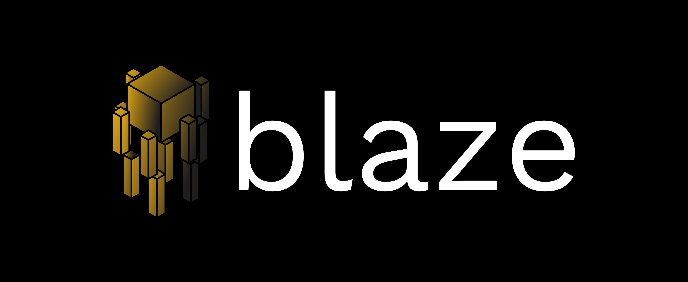
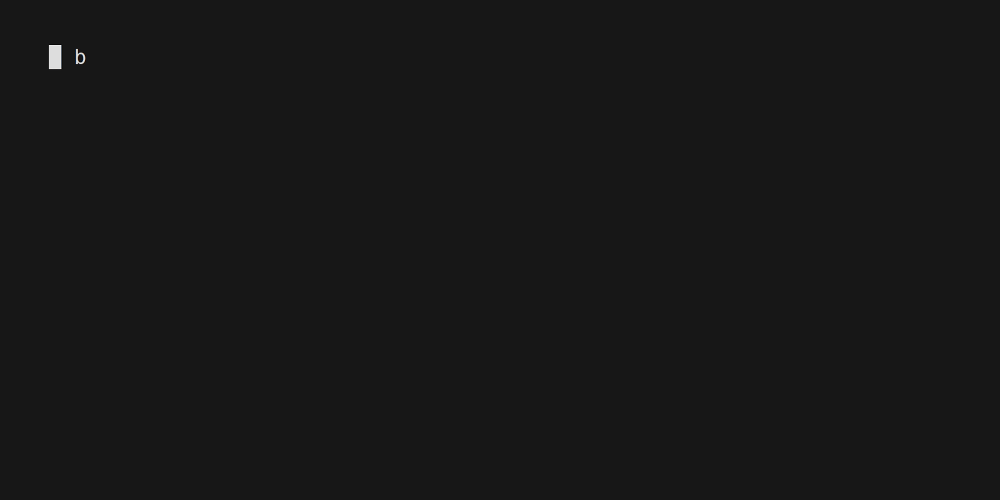

<h1 align="center">

</h1>

<div align="center">
<h2 align="center">A Minimal And Fast NodeJS Package Manager Written In Rust</h2>

[](https://github.com/humblepenguinn/blaze/workflows/CICD.yml)
[](https://crates.io/crates/blaze)

</div>
---



`Blaze` is a minimal Node.js package manager written in Rust, designed with a primary focus on speed and efficiency to enhance productivity and streamline workflows. This project aims to provide a blazingly fast alternative to existing package managers, catering to developers who seek optimal performance in their Node.js projects.

Please note that `Blaze` is currently in `beta`, and it is not recommended for production use at this stage. In the future as `Blaze` reaches a more stable state, it will be suitable for production environments, offering developers a powerful and swift Node.js package manager.

# Features
At its current beta stage, Blaze offers the following functionalities:

- `Initializing Node.js Projects`: Blaze allows you to quickly set up new Node.js projects, providing a solid foundation to kickstart your development process.

- `Package Installation: With Blaze`, you can effortlessly install Node.js packages, ensuring seamless integration of external libraries into your projects.

- `Package.json Dependency Resolution`: Blaze can interpret and install dependencies specified in your package.json files.

- `Custom Blaze Lock Files`: To further boost installation speed, Blaze can also generate custom lock files, optimizing package resolution for your specific project requirements. Lock files ensure that your project works consistently across all devices, preventing potential issues caused by version discrepancies.

### Releases

You can head over to the [releases page](https://github.com/humblepenguinn/blaze/releases/latest) and download the official `Blaze` binaries from there for your target operating system. `Windows MSI installers` are also available

### Cargo Repository

You can install `Blaze` through the Cargo repository using the following command:

```sh
$ cargo install blaze
```

### Source

Go [here](./docs/build_from_source.md) to see how

More methods of installation will be added in the future!

## Usage

Go [here](./docs/usage.md) to see how to use the tool

## Contributing

Contributions to `blaze` are always welcome! Please see the [Contributing Guidelines](CONTRIBUTING.md) for more information.

## License

This project is licensed under the [MIT](LICENSE-MIT) License and the [Apache](LICENSE-APACHE) License
